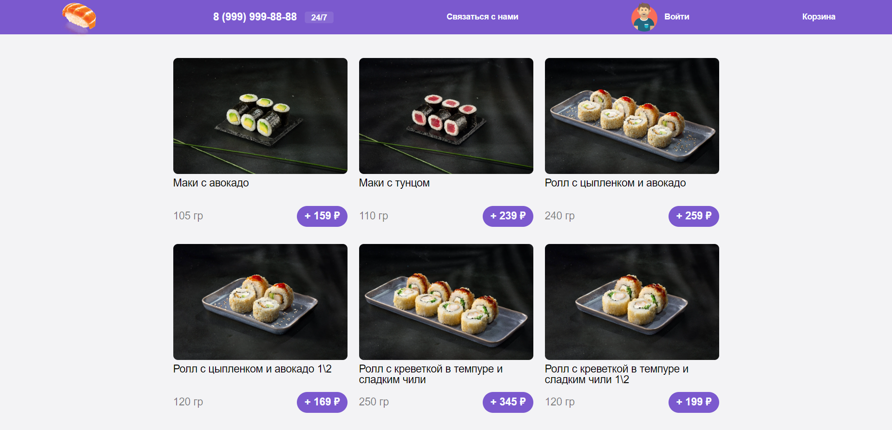
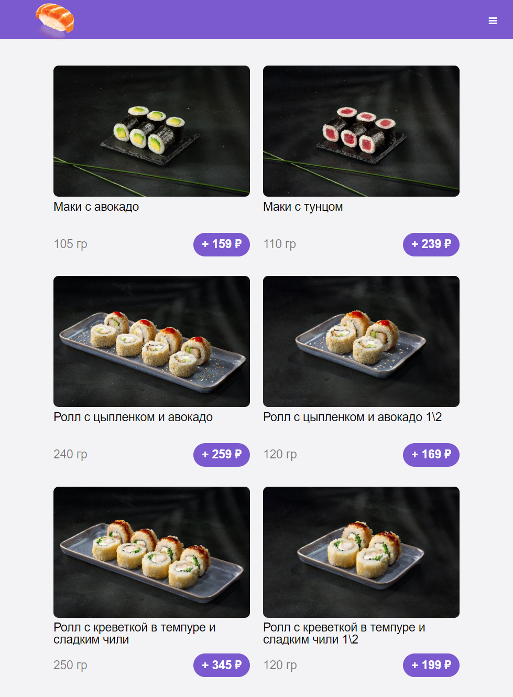
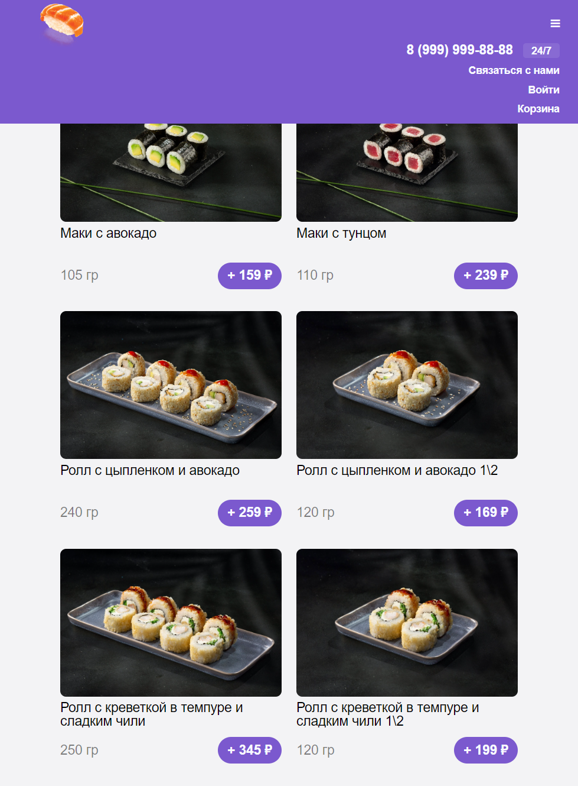

# About

Header Behavior by width

##### You can try it by link below:

<https://sosukii.github.io/sushi/>

Application, where you can see **How the header works** (the top of the page with site navigation):

1. with a *large screen width*, menu items are shown in one row;
2. with a very *small screen width*, the navigation elements (menu) are hidden under the "burger" button

### Demonstration of works

full width:

small-width:

small-width, when you tap the burger-button:

